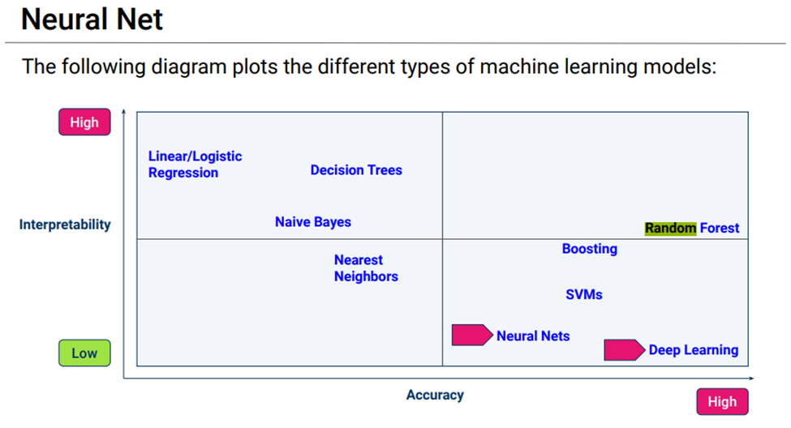

# Report on Neural Network Model – Alphabet Soup Charity Analysis

## Q1- Overview of the Analysis: Explain the purpose of this analysis

The nonprofit foundation Alphabet Soup wants a tool that can help it select the applicants for funding with the best chance of success in their ventures. Using machine learning and neural networks, we use the features in the provided dataset to see if we can predict with some degree of accuracy whether applicants will be successful if funded by Alphabet Soup.

## Q2 – Results: Using bulleted lists and images to support your answers, address the following questions:

### Data Preprocessing
#### What variable was the target for you model?
Our target is the ‘y’ which is in the “IS_SUCCESSFUL” column.
#### What variables are the features for your model?
Out features were “APPLICATION_TYPE”,”AFFILIATION”, “CLASSIFICATION”, “USE_CASE”, “ORGANIZATION”, “STATUS”, “INCOME_AMT”, “SPECIAL_CONSIDERATIONS”, “ASK_AMT”.
#### What variable should be removed from the input data because they are neither targets nor features?
“EIN” was removed from variables.

### Compiling Training and Evaluating the Model
#### How many neurons, layers and activation functions did you select for your neural network model and why?
I had three hidden layers and an outer layer. 
Hidden layer 1 = 89 neurons, activation = “relu”
Hidden layer 2 = 34 neurons, activation = “tanh”
Hidden layer 3 = 8 neurons, activation = “sigmoid”
Outer layer = 1 neuron, activation = “sigmoid”
#### Were you able to achieve the target model performance?
Yes we were able to achieve the target model performance.
#### What steps did you take in your attempts to increase the model performance?
By keeping name in the features, by increasing the hidden layers to three and increasing the neurons were able to increase the model performance from 73% to 78%.

## Q3 Summary:
Overall by optimizing the model we were able to increase the accuracy of the model to above 79%. Essentially what the model is telling us is that an applicant has close to an 80% chance of being successful if the NAME of the applicant appears more than 7 times (ie. They have applied more than 7 times) – the type of application is one of the following T3, T4,T5,T6,T19,T8, T7,T10 and the classification values for the application are C1000, C2000, C1200, C3000, C2100

## Alternative Model
An alternative model we would use would be Random Forest as we learned that is a good machine learning model for classification and besides it is possible we would be able to increase accuracy based on the diagram below.  We ran the random forest model in our optimization code we got an accuracy score above 77%.

